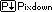

# Pixdown


ドットアニメーションに特化したラスタ画像軽量マークアップ言語


## How to write
Pixdownのデータ構造はヘッダーと内容の2つに分けられます
```
---
(ヘッダ部分)
---
(内容)
```

### ヘッダー
```toml
[size]
w = 2 # 幅
h = 2 # 高さ
scale = 256 # 拡大(縦, 横ともにscale倍)
frames = 8 # フレームの数
rate = [1, 4] # フレーム間隔 ([0]/[1] s)

[colors] # 色の定義
"0" = "#000000"
"1" = "#ffffff"

[options] # オプション(なくてもよい)
order = [1, 0, 1, 0, 0, 1, 0, 0] # 順序指定
```

### 内容
```md
# 0
## 0
10
01

## 1
01
10
```
`#`: レイヤー番号

`##`: フレーム番号

### 出力画像


## サンプル


[ソースコード](example/example.pixdown)

## How to use
### Rust project
#### Install
```sh
cargo add pixdown
```

#### Use
```rust
use pixdown::compile;
use std::fs::{File, read_to_string};
use std::io::Write;

fn main() {
    let text = read_to_string("example.pixdown").unwrap();
    if let Ok(b) = compile(&text) {
        let mut file = File::create("image.png").unwrap();
        file.write_all(&b).unwrap();
        file.flush().unwrap();
    }
}
```

## Demo
リファレンス実装が動かせます
```sh
cargo run -- [Pixdownファイル] [出力先]
```

## Donation
私に寄付するくらいなら私のファンアートを描くか私の曲を聴くかしてください

それでも寄付したい人はAblazeに寄付してあげてください

## License
[Rion Hobby License](LICENSE)で公開しています
